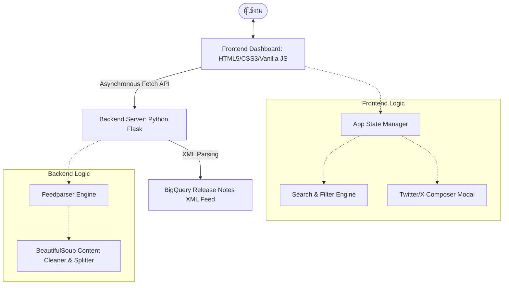
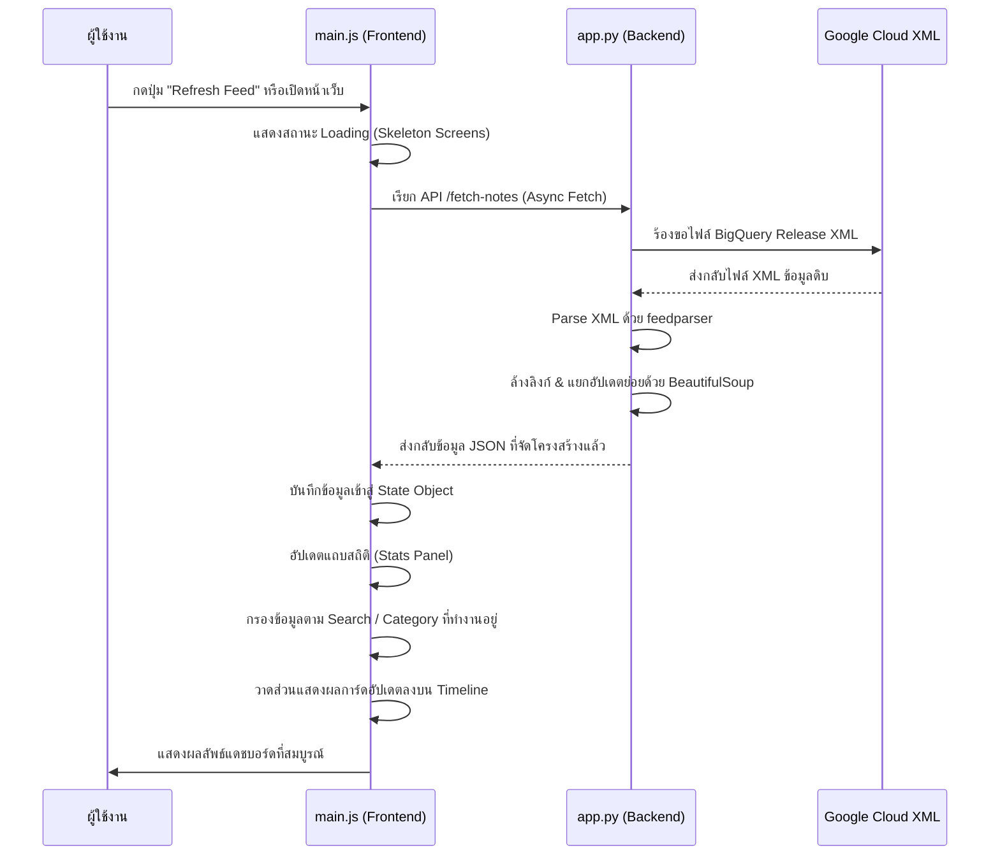

# เอกสารการออกแบบและสถาปัตยกรรม (Design & Architecture Document)
## Project: BigQuery Release Insights Dashboard

เอกสารฉบับนี้สรุปโครงสร้างการออกแบบ สถาปัตยกรรมระบบ และรายละเอียดการทำงานของ **BigQuery Release Insights Dashboard** ซึ่งเป็นแดชบอร์ดสำหรับติดตาม อัปเดต และแชร์ข่าวสารฟีเจอร์ต่าง ๆ ของ Google Cloud BigQuery ในรูปแบบที่ทันสมัย รวดเร็ว และใช้งานง่าย

---

## 1. สถาปัตยกรรมภาพรวม (System Architecture Overview)

ระบบใช้สถาปัตยกรรมแบบ **Client-Server Architecture** ที่แยกการทำงานระหว่างส่วนประมวลผลข้อมูลหลังบ้าน (Backend) และส่วนแสดงผลหน้าบ้าน (Frontend) โดยสมบูรณ์ ดังแผนภาพจำลองการทำงานต่อไปนี้:



---

## 2. สถาปัตยกรรมหลังบ้าน (Backend Architecture)

หลังบ้านพัฒนาขึ้นโดยใช้ภาษา **Python** และเฟรมเวิร์ก **Flask** ทำหน้าที่เป็น API Server และคอยดึงข้อมูลจาก Google Cloud Feed

### ส่วนประกอบหลัก (Key Components)
* **เฟรมเวิร์กหลัก:** [app.py](file:///D:/NhanceSolos/Kaggle/agy-cli-projects/bq-releases-notes/app.py) พัฒนาด้วย Flask ทำหน้าที่กำหนดเส้นทาง (Routing) และประมวลผลคำขอจากไคลเอนต์
* **ตัวแปลง Feed (XML Parsing):** ใช้ไลบรารี `feedparser` เพื่อดึงข้อมูลและแยกวิเคราะห์จาก RSS/Atom Feed ของ Google Cloud BigQuery (`https://docs.cloud.google.com/feeds/bigquery-release-notes.xml`)
* **ตัวจัดโครงสร้างข้อมูล (Content Processing Engine):** 
  - ใช้ `BeautifulSoup` (จาก `bs4`) ในการทำความสะอาดโค้ด HTML เช่น บังคับให้ลิงก์ทั้งหมดเปิดในแท็บใหม่ (`target="_blank"` และ `rel="noopener noreferrer"`) เพื่อความปลอดภัยและความสะดวกในการใช้งาน
  - แปลงเนื้อหา HTML เป็นข้อความธรรมดา (Plain Text) สำหรับใช้สร้างเนื้อหาทวีตโดยอัตโนมัติ
  - **การซอยย่อยอัปเดต (Sub-update Splitting):** เนื่องจาก Google Cloud จะรวมอัปเดตของแต่ละวันไว้ในโพสต์เดียว Backend จึงใช้ `BeautifulSoup` เพื่อมองหาแท็ก `<h3>` (เช่น Feature, Fixed, Changed, Announcement) และแยกเนื้อหารายวันออกเป็นรายการอัปเดตย่อย ๆ ทำให้แสดงผลบนหน้าแดชบอร์ดได้อย่างมีมิติและค้นหาได้ละเอียดขึ้น
* **API Endpoints:**
  - `GET /` : ให้บริการโครงสร้างหน้าเว็บหลัก (`templates/index.html`)
  - `GET /fetch-notes` : ดึงข่าวสารล่าสุดจาก Google Cloud แปลงข้อมูล ทำความสะอาด และส่งกลับไปในรูปแบบ JSON

---

## 3. สถาปัตยกรรมหน้าบ้าน (Frontend Architecture)

ฝั่งหน้าบ้านออกแบบตามแนวคิด **Single Page Application (SPA)** ที่มีความลื่นไหลสูง โดยใช้เทคโนโลยีเว็บพื้นฐาน (Vanilla Tech Stack) เพื่อประสิทธิภาพสูงสุดและไม่จำเป็นต้องพึ่งพาไลบรารีขนาดใหญ่

### ระบบสถานะของแอปพลิเคชัน (State Management)
ใน [main.js](file:///D:/NhanceSolos/Kaggle/agy-cli-projects/bq-releases-notes/static/js/main.js) มีการใช้โครงสร้างข้อมูลสถานะแบบรวมศูนย์ (Centralized State Object) เพื่อจัดระเบียบตรรกะของแอป:
```javascript
const state = {
    updates: [],           // ข้อมูลอัปเดตทั้งหมดที่ดึงมาจาก API
    filteredUpdates: [],   // ข้อมูลอัปเดตหลังจากผ่านการฟิลเตอร์/ค้นหา
    filters: {
        search: '',        // คำค้นหาปัจจุบัน
        category: 'all'    // หมวดหมู่ที่กำลังกรอง (Feature, Fixed, Changed ฯลฯ)
    },
    selectedUpdate: null,  // อัปเดตปัจจุบันที่กำลังจะถูกแชร์บน Twitter/X
    activeStyle: 'pro',    // รูปแบบการสร้างเนื้อหาทวีต (Professional, Hype, Dev Tip)
    lastRefreshed: null    // วันเวลาที่มีการอัปเดตล่าสุด
};
```

### การประมวลผลฝั่งไคลเอนต์ (Client-side Processing)
* **ระบบค้นหาและกรองข้อมูลแบบเรียลไทม์ (Search & Filter Engine):** ทำงานทันทีเมื่อผู้ใช้งานพิมพ์ค้นหาในช่อง Search หรือคลิกปุ่มตัวกรองในแถบด้านข้าง โดยจะทำการสแกนหาคำที่ตรงกันทั้งจากหัวข้อ ข้อมูลอัปเดต และหมวดหมู่ในหน่วยความจำ (Client Memory) ทำให้การกรองข้อมูลเกิดขึ้นทันทีโดยไม่ต้องส่งคำขอไปที่เซิร์ฟเวอร์ใหม่
* **ระบบสถิติสด (Live Statistics Panel):** สรุปข้อมูลเชิงปริมาณแยกตามประเภทอัปเดต (Feature, Announcement, Bug Fixes, Total) โดยนับข้อมูลสด ๆ จากผลลัพธ์การคิวรีที่ดึงมาจาก API
* **Twitter/X Composer Modal:** 
  - มีพรีเซ็ตเนื้อหา 3 รูปแบบ ได้แก่ **Professional** (แบบเป็นทางการ), **Hype** (แบบตื่นเต้น), และ **Dev Tip** (แบบแนะนำนักพัฒนา)
  - คำนวณความยาวตัวอักษรแบบไดนามิก โดยจำลองพฤติกรรมจริงของ Twitter ที่จะย่อลิงก์ทุกลิงก์ให้เหลือ 23 ตัวอักษรเสมอ (`t.co` rule)
  - วาดวงแหวนความก้าวหน้าตัวอักษรด้วย SVG (Progress Ring) ซึ่งจะเปลี่ยนสีตามโควตาข้อความที่เหลือ (สีน้ำเงิน/ม่วง -> สีส้มเตือน -> สีแดงเกินกำหนด)
  - เปิดเข้าสู่ Twitter Web Intent เพื่อส่งข้อมูลเข้าสู่บัญชี X ของผู้ใช้โดยตรง

---

## 4. ระบบการออกแบบและการตกแต่ง (Design System & CSS)

หน้าต่างแดชบอร์ดมีการนำหลักการออกแบบยุคใหม่มาประยุกต์ใช้เพื่อความสวยงามขั้นสูง (Premium Aesthetics):

* **Color Tokens (HSL System):** กำหนดรหัสสีในรูปแบบ HSL ใน [style.css](file:///D:/NhanceSolos/Kaggle/agy-cli-projects/bq-releases-notes/static/css/style.css) เพื่อช่วยให้ปรับแต่งค่าความโปร่งใส (Opacity) สำหรับเอฟเฟกต์กระจกได้ง่าย
* **Glassmorphism Layout:** พื้นหลังการ์ด ข้อมูลสรุป และหัวข้อ มีการใช้ `background: rgba(...)` ร่วมกับ `backdrop-filter: blur(20px)` และกรอบบาง ๆ ทำให้เกิดมิติโปร่งแสงซ้อนทับกันอย่างสวยงาม
* **Theme & Typography:** 
  - ใช้ **Dark Theme** เป็นหลัก เพื่อลดความเมื่อยล้าทางสายตาและขับสีกราฟิกเรืองแสงให้โดดเด่น
  - ใช้ฟอนต์ **Outfit** สำหรับหัวข้อหลัก (Headings), **Inter** สำหรับข้อมูลทั่วไป (Body text), และ **JetBrains Mono** สำหรับส่วนที่เป็นรหัสคำสั่งหรือสัญลักษณ์เฉพาะ
* **Dynamic Animations & Micro-interactions:**
  - เอฟเฟกต์ Hover บนการ์ดที่จะลอยขึ้นและเพิ่มความสว่างของขอบการ์ดอย่างนุ่มนวล
  - ปุ่มโหลดจำลอง (Skeleton Loading Screens) ในช่วงที่กำลังดึงข้อมูล เพื่อลดความรู้สึกว่าระบบกำลังค้าง
  - ไฟกะพริบแสดงสถานะเชื่อมต่อ (Pulsing Indicator Connection Dot)

---

## 5. การไหลของข้อมูล (Data Flow Diagram)

เมื่อผู้ใช้งานเข้าใช้แอปพลิเคชันหรือกดปุ่มรีเฟรช ข้อมูลจะเคลื่อนที่ตามลำดับขั้นตอนดังนี้:



---

## 6. โครงสร้างโฟลเดอร์โครงการ (Project Directory Structure)

โครงสร้างโฟลเดอร์ของระบบมีดังนี้:

```text
bq-releases-notes/
│
├── app.py                     # Backend Server (Flask) คอยจัดการ API และประมวลผล Feed
├── implementation_plan.md     # เอกสารการออกแบบและสถาปัตยกรรม (ไฟล์นี้)
│
├── templates/
│   └── index.html             # โครงสร้างหน้า Dashboard หลัก และส่วน Composer Modal
│
└── static/
    ├── css/
    │   └── style.css          # สไตล์ตกแต่ง, Design Tokens (HSL), และ Animations
    └── js/
        └── main.js            # ตรรกะฝั่งไคลเอนต์ (State, API fetch, Real-time Filters, Twitter Share)
```
