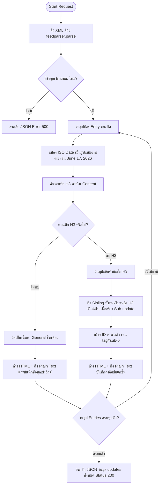

# ⚙️ คำอธิบายไฟล์หลักของเซิร์ฟเวอร์: app.py
## 🚀 BigQuery Release Insights Dashboard

ไฟล์ **[app.py](file:///D:/NhanceSolos/Kaggle/agy-cli-projects/bq-releases-notes/app.py)** ทำหน้าที่เป็นจุดศูนย์กลางของฝั่งเซิร์ฟเวอร์ (Flask Backend) ทำหน้าที่ดึงข้อมูล XML Feed จากภายนอก แปลงโครงสร้างข้อมูล (Parsing) จัดรูปแบบข้อความ และทำหน้าที่ให้บริการ API แก่ฝั่งไคลเอ็นต์ (Frontend Dashboard)

---

## 🔍 ฟังก์ชันผู้ช่วยหลัก (Helper Functions)

ในไฟล์นี้มีฟังก์ชันเสริมสำหรับล้าง HTML และจัดระเบียบข้อความดังนี้:

### 1. `[clean_html_content](file:///D:/NhanceSolos/Kaggle/agy-cli-projects/bq-releases-notes/app.py#L11)`
* **จุดประสงค์:** ล้างและปรับแต่งลิงก์ HTML เพื่อความปลอดภัยและความสะดวกของผู้ใช้
* **การทำงาน:** 
  - ใช้ `BeautifulSoup` ในการแปลงเนื้อหา HTML 
  - ค้นหาแท็ก `<a>` (Hyperlink) ทั้งหมด 
  - บังคับใส่แอตทริบิวต์ `target="_blank"` และ `rel="noopener noreferrer"` เพื่อให้ลิงก์ปลายทางเปิดในแท็บใหม่เสมอโดยไม่สร้างความเสี่ยงต่อสิทธิ์การเข้าถึงบราวเซอร์
* **โครงสร้างโค้ด:**
  ```python
  def clean_html_content(html_str):
      if not html_str:
          return ""
      soup = BeautifulSoup(html_str, 'html.parser')
      for a in soup.find_all('a'):
          a['target'] = '_blank'
          a['rel'] = 'noopener noreferrer'
      return str(soup)
  ```

### 2. `[extract_text_for_tweet](file:///D:/NhanceSolos/Kaggle/agy-cli-projects/bq-releases-notes/app.py#L23)`
* **จุดประสงค์:** แปลงเนื้อหา HTML ให้กลายเป็นข้อความธรรมดา (Plain Text) เพื่อนำไปใช้งานใน Twitter/X Composer ฝั่งไคลเอ็นต์
* **การทำงาน:** 
  - ใช้ BeautifulSoup ค้นหาเฉพาะเนื้อหาที่เป็นตัวอักษรและตัดแท็ก HTML ทั้งหมดทิ้ง
  - ใช้ Regular Expression (`re.sub(r'\s+', ' ', text)`) เพื่อกำจัดการเว้นวรรคและการขึ้นบรรทัดใหม่ที่เกินความจำเป็นให้เหลือเพียง 1 เคาะมาตรฐาน
* **โครงสร้างโค้ด:**
  ```python
  def extract_text_for_tweet(html_str):
      if not html_str:
          return ""
      soup = BeautifulSoup(html_str, 'html.parser')
      text = soup.get_text()
      text = re.sub(r'\s+', ' ', text).strip()
      return text
  ```

---

## 📡 เส้นทาง API และการควบคุม (Endpoints & Controller Logic)

แอปพลิเคชันมีการลงทะเบียน Route สำหรับจัดการคำขอดังนี้:

### 1. `[index](file:///D:/NhanceSolos/Kaggle/agy-cli-projects/bq-releases-notes/app.py#L37)` (`GET /`)
* ทำหน้าที่ให้บริการหน้า Dashboard หลักแบบ Single Page Application (SPA) โดยส่งไฟล์โครงร่าง HTML หลักคืนกลับไป (`templates/index.html`)

### 2. `[fetch_notes](file:///D:/NhanceSolos/Kaggle/agy-cli-projects/bq-releases-notes/app.py#L41)` (`GET /fetch-notes`)
เป็น Endpoint หลักสำหรับประมวลผลข้อมูลฟีด มีขั้นตอนการทำงานภายในดังนี้:



#### คุณสมบัติพิเศษการแยกย่อยเนื้อหา (Sub-updates Splitting)
เนื่องจาก Google Cloud มักจะรวมข่าวสารหลายชิ้นของวันเดียวกันไว้ในโพสต์เดียว ทำให้ผู้ใช้ตรวจสอบยากและฟิลเตอร์เฉพาะเรื่องไม่ได้ โค้ดในส่วนนี้จึงแก้ปัญหาโดยการแบ่งตามแท็ก `<h3>` ของเนื้อหา:
```python
# ค้นหาแท็ก h3 เพื่อใช้แบ่งหัวข้อย่อย
h3s = soup.find_all('h3')

# ค้นหาและรวบรวม element ลูกพี่ลูกน้องทั้งหมดที่อยู่ถัดจาก h3 ตัวนั้นๆ จนกว่าจะเจอ h3 ตัวใหม่
siblings = []
curr = h3.next_sibling
while curr and curr.name != 'h3':
    if curr.name or (isinstance(curr, str) and curr.strip()):
        siblings.append(curr)
    curr = curr.next_sibling
```

---

## 🚀 การสั่งทำงานเซิร์ฟเวอร์ (Application Entry Point)

เมื่อรันแอปพลิเคชันโดยตรงผ่านคำสั่ง `python app.py`:
* ระบบจะเปิดใช้งานบน IP `127.0.0.1` พอร์ต `5000`
* เปิดโหมด `debug=True` เพื่อความสะดวกในการดีบั๊กและตรวจสอบระหว่างพัฒนา
* โครงสร้างโค้ด:
  ```python
  if __name__ == '__main__':
      app.run(host='127.0.0.1', port=5000, debug=True)
  ```
