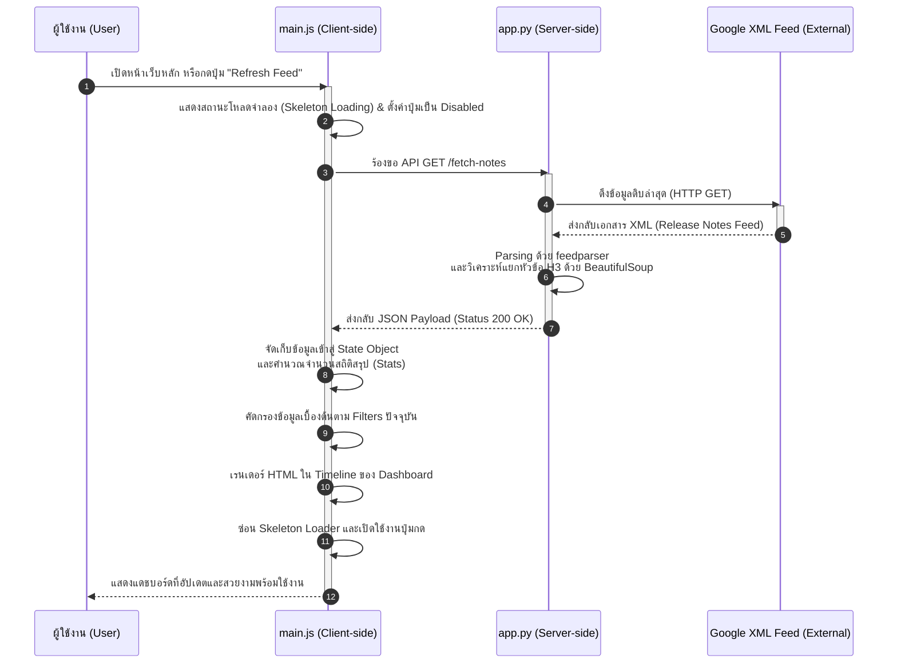
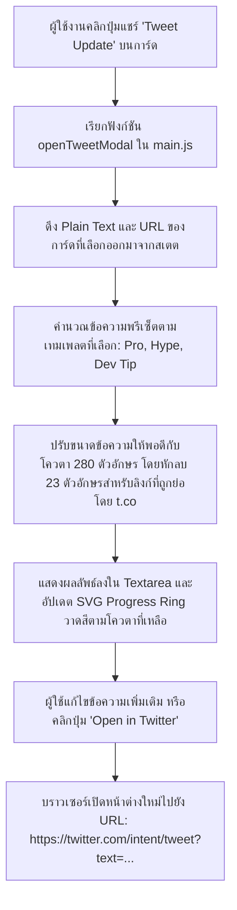

# 📊 รายละเอียดโครงสร้างและสถาปัตยกรรมโครงการ (Project Architecture & Data Flow)
## 🚀 BigQuery Release Insights Dashboard

เอกสารนี้รวบรวมรายละเอียดการทำงาน โครงสร้างระบบ และลำดับขั้นตอนการส่งผ่านข้อมูล (Data Flow & Payload) ของระบบแดชบอร์ดติดตามข้อมูลอัปเดต Google Cloud BigQuery เพื่อให้เข้าใจการทำงานแบบแยกส่วนระหว่าง **ฝั่งเซิร์ฟเวอร์ (Server-side)** และ **ฝั่งไคลเอ็นต์ (Client-side)** อย่างสมบูรณ์

---

## 🛠️ การแบ่งส่วนการทำงาน (Client-Server Separation)

เพื่อให้การทำงานรวดเร็วและไม่สร้างภาระให้เซิร์ฟเวอร์ของ Google Cloud มากเกินไป ระบบนี้จึงถูกออกแบบมาให้มีขอบเขตความรับผิดชอบ (Separation of Concerns) ที่ชัดเจน ดังนี้:

### 📋 ตารางเปรียบเทียบหน้าที่รับผิดชอบ (Responsibilities Matrix)

| ฝั่งการทำงาน (Component) | หน้าที่รับผิดชอบหลัก (Key Responsibilities) | เทคโนโลยีหลัก (Tech Stack) | ไฟล์ที่เกี่ยวข้อง (File Path) |
| :--- | :--- | :--- | :--- |
| **เซิร์ฟเวอร์ (Server-side / Backend)** | - เป็น Web Server บริการไฟล์ static และหน้าเว็บหลัก<br>- ดึงไฟล์ XML จาก Google Cloud Feed<br>- แยกแยะประเภทข้อมูลและย่อยเนื้อหาตามแท็ก `<h3>`<br>- ล้าง HTML ลิงก์ที่อันตรายและแปลงเป็น Plain Text | Python 3, Flask, `feedparser`, `BeautifulSoup4` | [app.py](file:///D:/NhanceSolos/Kaggle/agy-cli-projects/bq-releases-notes/app.py) |
| **ไคลเอ็นต์ (Client-side / Frontend)** | - แสดงผล UI แบบ Responsive (Glassmorphism Dark Mode)<br>- จัดการสเตตของแอปพลิเคชันแบบรวมศูนย์ (App State)<br>- ค้นหา กรองหมวดหมู่ และสรุปตัวเลขสถิติแบบเรียลไทม์ในแรม<br>- จัดการหน้าต่างแชร์โพสต์ไปยัง X / Twitter (Smart Composer) | HTML5, CSS3 Variables, Vanilla JavaScript | [index.html](file:///D:/NhanceSolos/Kaggle/agy-cli-projects/bq-releases-notes/templates/index.html)<br>[style.css](file:///D:/NhanceSolos/Kaggle/agy-cli-projects/bq-releases-notes/static/css/style.css)<br>[main.js](file:///D:/NhanceSolos/Kaggle/agy-cli-projects/bq-releases-notes/static/js/main.js) |

---

## 💡 ฟีเจอร์หลักของระบบ (Core Features)

1. **XML Parser & Splitter Engine:** หลังบ้านทำหน้าที่ดึง XML feed ดิบ แล้วแยกแยะข่าวสารหนึ่งวันที่มีหลายหัวข้อย่อย (Sub-updates) ออกเป็นอาร์เรย์ของอัปเดตแบบรายชิ้นตามแท็ก `<h3>` เช่น `Feature`, `Announcement`, `Fixed`, `Deprecated` ทำให้กรองข้อมูลได้ละเอียดขึ้น
2. **HTML Sanitization & Prep:** ล้างเนื้อหาให้ปลอดภัย ปรับแต่งลิงก์ทั้งหมดให้เปิดในแท็บใหม่ด้วยความปลอดภัย (`target="_blank"` และ `rel="noopener noreferrer"`) พร้อมสร้าง Plain Text เปล่าเตรียมไว้สำหรับ Composer
3. **In-Memory Instant Search:** ค้นหาคำสแกนเนื้อหาเรียลไทม์บนบราวเซอร์จากออบเจกต์สเตตที่มีอยู่ทันที โดยไม่ต้องร้องขอไปยัง API ซ้ำทุกครั้งที่ผู้ใช้งานพิมพ์คิวรี
4. **Interactive Stats Counter:** สรุปตัวเลขสถิติจำนวนข่าวสารแต่ละหมวดหมู่และแสดงในแถบข้างด้านซ้ายแบบมีสีสันระบุประเภทชัดเจน ซึ่งใช้เป็นปุ่มฟิลเตอร์ย่อยได้ด้วย
5. **Smart X/Twitter Composer:** หน้าต่างโมดอลสำหรับเขียนโพสต์ สามารถเลือกสไตล์ของข้อความได้ 3 รูปแบบ (Professional, Hype, Dev Tip) คำนวณขีดจำกัด 280 ตัวอักษรพร้อมชดเชยการย่อลิงก์จริงของทวิตเตอร์ (23 ตัวอักษรตามมาตรฐาน `t.co`) และแสดงวงแหวน SVG Progress Ring กราฟิกที่เปลี่ยนสีไปตามโควตาที่เหลือ
6. **Premium Dark Glassmorphism Design:** สไตล์การออกแบบที่โดดเด่นด้วยโทนสีมืด ใช้ระดับสี HSL และแอนิเมชันที่ลื่นไหล มีระบบ Skeleton Loading แสดงในส่วน Feed ระหว่างการแลกเปลี่ยนข้อมูล เพื่อไม่ให้หน้าเว็บดูค้าง

---

## 🔄 โฟลว์การทำงานจำลอง (Example Workflow: Request & Response)

แผนภาพลำดับขั้นตอนการร้องขอข้อมูลข่าวสารและนำมาวาดผลบนแดชบอร์ด:



---

## 📡 รายละเอียดโครงสร้างข้อมูลตัวอย่าง (Request & Response Details)

เมื่อฝั่งไคลเอนต์ต้องการข้อมูล จะส่งคำขอดังนี้:

### 1. ฝั่งไคลเอนต์ร้องขอ (Request)
* **URL:** `/fetch-notes`
* **Method:** `GET`
* **Headers:** `Accept: application/json`

### 2. ฝั่งเซิร์ฟเวอร์ตอบกลับ (Response)
* **Status:** `200 OK`
* **Content-Type:** `application/json`
* **Body (JSON Structure):**

```json
{
  "success": true,
  "feed_title": "BigQuery Release Notes",
  "feed_link": "https://cloud.google.com/bigquery/docs/release-notes",
  "updated": "2026-06-17T00:00:00-07:00",
  "updates": [
    {
      "id": "tag:google.com,2010:cloud-release-notes:bigquery-2026-06-17#sub-0",
      "date": "June 17, 2026",
      "raw_date": "2026-06-17T00:00:00-07:00",
      "type": "Feature",
      "content": "<p>You can now use Google-managed encryption keys with your tables. For details, see <a href=\"https://cloud.google.com/bigquery/docs/encryption\" target=\"_blank\" rel=\"noopener noreferrer\">Encryption keys</a>.</p>",
      "plain_text": "You can now use Google-managed encryption keys with your tables. For details, see Encryption keys.",
      "feed_link": "https://cloud.google.com/bigquery/docs/release-notes"
    },
    {
      "id": "tag:google.com,2010:cloud-release-notes:bigquery-2026-06-17#sub-1",
      "date": "June 17, 2026",
      "raw_date": "2026-06-17T00:00:00-07:00",
      "type": "Fixed",
      "content": "<p>Fixed an issue where query jobs using external data sources would occasionally return a 500 error.</p>",
      "plain_text": "Fixed an issue where query jobs using external data sources would occasionally return a 500 error.",
      "feed_link": "https://cloud.google.com/bigquery/docs/release-notes"
    }
  ]
}
```

---

## 🚀 ลำดับขั้นตอนการแชร์ข้อมูลไปยัง Twitter/X (X / Twitter Intent Flow)

เมื่อผู้ใช้งานต้องการแชร์อัปเดตเฉพาะรายการ:



> [!TIP]
> **การคำนวณโควตาตัวอักษรของทวิตเตอร์ในสคริปต์:** 
> รหัสใน [main.js](file:///D:/NhanceSolos/Kaggle/agy-cli-projects/bq-releases-notes/static/js/main.js#L502-L511) จะแยกหาที่อยู่ URL ทั้งหมดในข้อความก่อน จากนั้นลบความยาวตัวอักษรเดิมของลิงก์ออกทั้งหมด แล้วบวกกลับเข้าไปลิงก์ละ 23 ตัวอักษร ทำให้ผลลัพธ์ของตัวเลขตัวอักษรที่เหลือตรงตามข้อจำกัดของแพลตฟอร์ม X (Twitter) จริง ๆ ก่อนจะเปิดหน้าต่าง Intent ไปโพสต์!
