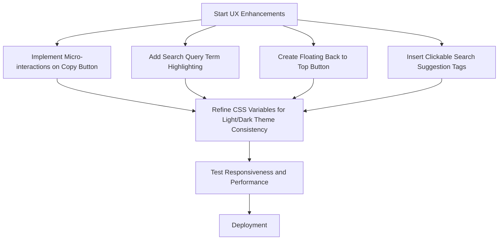

# UX/UI Evaluation Report
## BigQuery Release Insights Dashboard

This report evaluates the UX/UI of the **BigQuery Release Insights Dashboard** based on usability, responsiveness, aesthetics, utility, and user feedback loops.

---

## 🌟 Current Strengths
The application already features a highly modern, professional, and responsive design system. Key strengths include:
* **Rich Aesthetics**: The glassmorphic design, subtle glowing effects, and distinct HSL color tokens create a premium cloud console feel.
* **Interactive Filtering**: Connecting the "Live Statistics" grid as filter controls is an excellent UX shortcut, reducing the distance between data viewing and action.
* **Seamless Tweeting Experience**: The Twitter Composer modal with custom styles (Professional, Hype, Dev Tip) and interactive character progress ring provides a very premium workflow.
* **Theme Memory**: The Light/Dark theme switcher preserves user preference using `localStorage`, keeping consistency on page reloads.
* **Data Portability**: Export to CSV with UTF-8 BOM ensures seamless opening in Microsoft Excel without character encoding issues (no broken Thai fonts).

---

## 🔍 Areas for Improvement & Actionable Enhancements

### 1. Contextual Clipboard Feedback (Micro-interactions)
> [!NOTE]
> **Current Issue**: Clicking "Copy to Clipboard" shows a bottom-right toast message, but the button itself stays static.
> **Proposed Fix**: Change the icon and button label temporarily to a green checkmark and "Copied!" for 2 seconds. This local feedback is much faster for the user to register than looking at the bottom-right corner.

### 2. Search Query Highlighting
> [!TIP]
> **Current Issue**: When searching (e.g., "SQL"), matching cards are shown, but users must read the entire text block to find where the search term appears.
> **Proposed Fix**: Use simple JavaScript regex to wrap matching query terms in a `<mark class="search-highlight">` tag within the card body, making scanned search results instantly readable.

### 3. "Back to Top" Scroll Button
> [!IMPORTANT]
> **Current Issue**: The timeline feed contains a large volume of historical data. Scrolling down makes the sidebar filters/search inaccessible (since they scroll out of view on mobile or taller layouts).
> **Proposed Fix**: Add a floating "Back to Top" button that fades in once the user scrolls down beyond 300px, allowing instant return to search and navigation filters.

### 4. Search Suggestion Tags
> [!NOTE]
> **Current Issue**: The empty state gives text hints (e.g., "SQL", "Gemini") but requires manual typing.
> **Proposed Fix**: Add clickable query suggestions (tags) directly below the search input or in the empty state (e.g., `#SQL`, `#Storage`, `#Security`, `#Billing`) to help users search with one click.

### 5. Web Share API Integration
> [!TIP]
> **Current Issue**: Sharing is locked to Twitter/X.
> **Proposed Fix**: Add a third action button on cards to trigger the native OS Web Share API (`navigator.share`) on mobile devices, allowing users to send updates directly to Slack, Microsoft Teams, LINE, or email.

---

## 🛠️ Implementation Plan

| Priority | UX Category | Improvement Item | Estimated Effort |
| :--- | :--- | :--- | :--- |
| **High** | Usability | Contextual Copy Button Feedback | Low (15 mins) |
| **High** | Usability | Search Query Term Highlighting | Medium (30 mins) |
| **Medium** | Navigation | Floating "Back to Top" Button | Low (20 mins) |
| **Medium** | Onboarding | Clickable Search Suggestion Tags | Low (20 mins) |
| **Low** | Sharing | Native Web Share API Support | Low (15 mins) |

---
> [!NOTE]
> All suggested items can be implemented with vanilla CSS adjustments and simple client-side JavaScript additions without modifying the backend.
